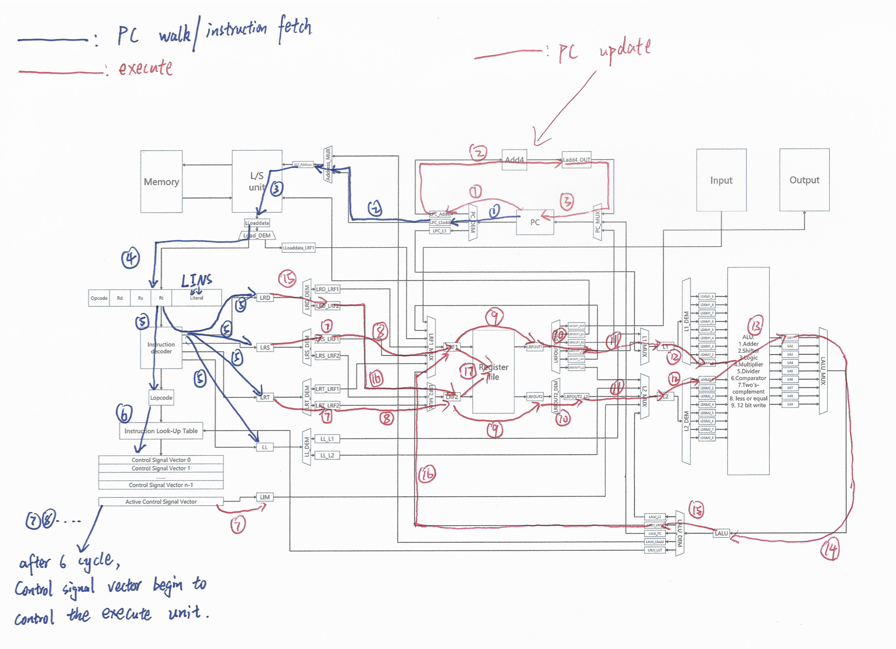

# Tinker: A CPU Simulator Made by Tinkers

***Omar Zawawi, Kuilian Yang, Sadiq Albinalshaikh, Jihao Xin***

Tinker is a C++ based CPU simulator, it takes binary instruction as input, running with virtual cycles. Tinker tries to simulate how signal flows in real hardware, by the meantime utilized the advantages of software to simplify the execution.

## User Guide

Tinker comes with **Makefile** and is designed to be easy to use.

All code is in the `src` folder.

`assembly` contains the demo assembly code can be used directly. (Our format is a little different with the given).

`Control Signals.xlsx` is the file for all instructions's control signals, each vector has 150 bits.

`Extra Devices.pdf` explained some unit we used not in the given specification.

`Architecture-Add.pdf` & ``Instructions-Add.pdf` are a detailed explaination for how **add** instruction will work in our design.

* **Compile Assembly **

  The first step is to compile assembly code to binary with our `tinker_assembler`. 

  ```shell
  git clone git@github.com:JihaoXin/Tinker.git
  cd devices
  make tinker_assembler
  ./tinker_assembler [source file name]
  ```
  
  The assembler takes a source file name as an argument and outputs the binary to `code` .
  
  Whitespace have syntactic meaning in the assembler. Comments are not supported.
  
  The format of assembly please refer to the appendix.
  
* **Simulate**
  
  ```shell
  make
  ./main
  ```
  
* **Test**

  We also provided **unit test** to test all component.
  ```shell
	make device_test
	./device_test
	```

# Architecture

We proposed the a comprehensive design, It tries best to simulate how **real hardware** works.


One complexity comes from the **circle**, we carefully analyzed the dependencies.

We use add as an illustration of how signal is flowed:



At the start of program, the **PC** is initialized point to memory 0 and **Control Array** is initialized with signals to **fetch**.

<u>*Some Key Components are here:*</u>

>* Decoder
>Firstly, the binary instruction will fetch to the decoder, where it will pass the register&immediate values to corresponding multiplexers, and the opcode will be sent to the lookup table 
>
>* Lookup Table
>
>Lookup Table will translate the opcode to pre-defined control signals and pass it to Control Array
>
>In our design, the lookup table will pass the control signal at the speed of 1 instruction / 1 cycle, instead of 1 control signal / 1 cycle. Because it is the Control Array that should do the buffering instead of a Lookup table.
>
>* Control Array
>
>Control Array is a queue of control signal vectors, which will be split into devices below Control Array's max size is 64.
>
>* Register File
>
>Register File contains 32 registers.
>
>We also implemented Multi-Ported register file according to the specification, but we did not use it in the simulation.
>
>* ALU
>
>ALU is a group of independent devices, which can perform varieties of arithmetic.
>
>* L/S \& Memory
>
>We treat L/S \& Memory as a single device,  where memory is an Array in the Load-Store unit.
>
>* I/O Device
>
>Each device will take two ports as input, one indicates the input/output port and the other is the value.
>
>But as this is the simulation for the processor regardless of the number of peripherals, also based on the fact that the given test instruction always uses the same in/out port "r0", the Input Device always takes standard input from the keyboard while the Output Device always prints on the screen.

* **Simplified design**

  We implemented the comprehensive design, but it comes with very high cycles.

  We argue the more cycle & control signal we did, the more effort we made.

  But we do not want to lose the competition 😠.

  So we also implemented a simplified design which utilized software's ease of use to achieve some logics.

  ```shell
  git checkout simplified
  ```

  We hide the branch logic by *if* and *else* in *C++* thus we can update the PC based on the condition instruction's result, which means we simplified the interaction between PC and Register File.

  

  We compared both at `hello.tnk`.

  |                 | Comprehensive | Simplified |
  | --------------- | ------------- | ---------- |
  | Control Signals | 150           | 63         |
  | Cycles          | 408           | 153        |

  Although this gives better results, we decides to stick on the comprehensive design.

## Code

* **Connection**

  The connection is done by the **pointer**.

  We make every **outport** as `long long` and every **inport** as `*long long`.

  Such as the figure below, A will send a signal to B so A's outport and B's inport should be connected.

  The value only stores in A's outport, thus B's inport is not a copy but a pointer to A's outport.

  By doing this we only need to connect once** then we can guarantee the inport of B will be always the same as outport of A.

  This is also aligned with hardware as the data flows in a short circuit without a latch is very fast, should be treated as always same.

  

* **Latch**

  Between every two devices, there's a Latch in between. This is more similar to hardware and better for pipelining.

* **Cycles**

  The virtual cycle is simulated by an infinite for loop.

  After the connection is done, the for loop will call the **receive_clock** function of all devices.

  The **receive_clock** function will update its internal clock counter, and do arithmetic or pass data based on its clock counter.

* **Data Flows**

  In real hardware, all data should move together. 

  In the simulation, we use sequential coding so there might be **overwriting** issue.

  Assume call **A**'s **receivce_clock** first, the outport value of A might be updated. When we then call **B**, the inport will point to the new value which is not what we want.

  To address this, we should call **receivce_clock** backward.

  When there's a circle, we **manually analyze the dependencies** and decide which one should be called first.

* **Data Types**

  All the data in the flow and register file, and memory, are declared as `long long`.

  One exception is the **control signal** because we are using more than 64 control signals.

  We use `std::array<bool, 148>` to represent one control signal.

  The Control Array will decode std::array for each unit to `long long` based on its corresponding bits.

* **Condition**

  The condition instruction is not deterministic when the fisrt time issues the control signal.

  Thus we cut the branch instruction into **stages** and add a **feedback** connection from **ALU** to **Lookup Table**.

  

  Such as for **brnz**, when the Lookup Table realized it is a condition instruction, then it will first issue the control signal to **compare rs and 0**, then based on the feedback connection, it will decide to issue control signals for `pc<-pc+4` or `pc=rd`.

## Analysis

* **Total Cycles**

  | hello.tnk | Arithmetic.tnk |
  | --------- | -------------- |
  | 408       | 337            |

* **Instructions**

  The table describe the cycles needed to complete each instruction. For example, the fetch and decode will spend 6 cycles, and it is same for all the instructions. For the integer arithmetic, logic, data movement and I/O instructions, we need to do some calculation or data movement, these are counted into execution cycles. And this PC update operation is just pc = pc + 4. For the control instructions, they only update the PC. And for the branch instructions, like brnz and brgt, the pc update operation is based on the result of comparators, so the number of PC cycles depends. The sum cycles to complete is just the summation of these three parts. However, maybe we can do some parallel operations. For example, the add instructions, the instruction fetch and decode, execution and PC update part need 6, 11 and 3 cycles respectively. When we are executing the execution part, we could also do PC update and then do instruction fetch and decode for the next instruction in parallel. So, the potential parallel cycles to complete this instruction is 11 cycles.
  Note that the potential parallel cycles = max(#execution, #instruction fetch and decode + #PC update).

  | Instructions      | instruction  fetche and decode | execution | PC updata | sum cycles to  complete | potential  parallel cycles to complete |
  | ----------------- | ------------------------------ | --------- | --------- | ----------------------- | -------------------------------------- |
  | add rd, rs, rt    | 6                              | 11        | 3         | 20                      | 11                                     |
  | addi rd, L        | 6                              | 11        | 3         | 20                      | 11                                     |
  | sub rd, rs, rt    | 6                              | 16        | 3         | 25                      | 16                                     |
  | subi rd, L        | 6                              | 13        | 3         | 22                      | 13                                     |
  | mul rd, rs, rt    | 6                              | 13        | 3         | 22                      | 13                                     |
  | div rd, rs, rt    | 6                              | 18        | 3         | 27                      | 18                                     |
  | and rd, rs, rt    | 6                              | 11        | 3         | 20                      | 11                                     |
  | or rd, rs, rt     | 6                              | 11        | 3         | 20                      | 11                                     |
  | xor rd, rs, rt    | 6                              | 11        | 3         | 20                      | 11                                     |
  | not rd, rs        | 6                              | 11        | 3         | 20                      | 11                                     |
  | shftr rd, rs,  rt | 6                              | 11        | 3         | 20                      | 11                                     |
  | shftri rd, L      | 6                              | 11        | 3         | 20                      | 11                                     |
  | shftl rd, rs,  rt | 6                              | 11        | 3         | 20                      | 11                                     |
  | shftli rd, L      | 6                              | 11        | 3         | 20                      | 11                                     |
  | br rd             | 6                              | 0         | 5         | 11                      | 11                                     |
  | brr rd            | 6                              | 0         | 10        | 16                      | 16                                     |
  | brr L             | 6                              | 0         | 7         | 13                      | 13                                     |
  | brnz rd, rs       | 6                              | 10        | 3 or 5    | 19 or 21                | 10 or 11                               |
  | brgt rd, rs,  rt  | 6                              | 10        | 3 or 5    | 19 or 21                | 10 or 11                               |
  | Halt              | 6                              | 0         | 0         | 6                       | 6                                      |
  | mov rd,  (rs)(L)  | 6                              | 14        | 3         | 23                      | 14                                     |
  | mov rd, rs        | 6                              | 6         | 3         | 15                      | 9                                      |
  | mov rd,L          | 6                              | 11        | 3         | 20                      | 11                                     |
  | mov (rd)(L),  rs  | 6                              | 11        | 3         | 20                      | 11                                     |
  | in rd, rs         | 6                              | 7         | 3         | 16                      | 9                                      |
  | out rd, rs        | 6                              | 5         | 3         | 14                      | 9
  \|                                    |

* **Power & Area**

  The table describe the summary how many devices we have and what is the area and power in total. Here, we use 11 demultiplexers and 7 multiplexers for devices connection, 5 registers to store the value from the instruction. All the other devices are only used once. So basically, this architecture could only realize all the instructions, but could only realize parallelism inside one instruction, not between instructions (like pipeline)
  The total area 121200 nm2, and the total power consumption is 49.7W.
  
  | Device                     | area(nm^2) | power(W) | number | Total area (nm^2) | Total power (W) |
  | -------------------------- | ---------- | -------- | ------ | ----------------- | --------------- |
  | Adder                      | 400        | 0.5      | 1      | 400               | 0.5             |
  | Shifter                    | 200        | 0.5      | 1      | 200               | 0.5             |
  | Logic                      | 600        | 0.75     | 1      | 600               | 0.75            |
  | Multiplier                 | 2000       | 1.5      | 1      | 2000              | 1.5             |
  | Divider                    | 5000       | 1        | 1      | 5000              | 1               |
  | Comparator                 | 400        | 0.5      | 1      | 400               | 0.5             |
  | Two's  Complement          | 200        | 0.25     | 1      | 200               | 0.25            |
  | Register File              | 20000      | 4        | 1      | 20000             | 4               |
  | Multiplexer 16             | 2500       | 1.25     | 7      | 17500             | 8.75            |
  | Demultiplexer  16          | 2500       | 1.25     | 11     | 27500             | 13.75           |
  | Program  counter           | 200        | 0.05     | 1      | 200               | 0.05            |
  | Register                   | 200        | 0.05     | 5      | 1000              | 0.25            |
  | Control Array  (150 *30)   | 4500       | 4.5      | 1      | 4500              | 4.5             |
  | Add4                       | 100        | 3.2      | 1      | 100               | 3.2             |
  | Less or Equal              | 600        | 1        | 1      | 600               | 1               |
  | 12-bit write               | 300        | 0.5      | 1      | 300               | 0.5             |
  | L/S unit                   | 20000      | 4        | 1      | 20000             | 4               |
  | Input                      | 150        | 0.1      | 1      | 150               | 0.1             |
  | Output                     | 150        | 0.1      | 1      | 150               | 0.1             |
  | Instruction  Look-Up Table | 20000      | 4        | 1      | 20000             | 4               |
  | Instruction  decoder       | 400        | 0.5      | 1      | 400               | 0.5             |
  | All                        |            |          | 41     | 121200            | 49.7            |
  |                            |            |          |        |                   |                 |

## Some Compromise

We made some compromises to finish the project.

* We did not do pipeline.
* We did not implement a real cache, we abstract all memory access in the L/S unit with a high cycle cost.
* We did not utilize multi port register.
* We only tested the `arithmetic.tnk` and `hello.tnk`. We strong believe the branch signal should wrok but we are still debuging the `logic.tn`.


# Appendix

Syntax, watchout for the tabs and spaces:

```
[opcode] [r_d], [r_s], [r_t]
[opcode] [r_d], [r_s]
[opcode] [r_d], ([r_s])[L])
[opcode] ([r_d])([L]), [r_s]
[opcode] [r_d], [r_s]
[opcode] [r_d]
[opcode] [L]
```

Supported instructions in the assembler (no tabs, and no whitespace before instructions) also acts as an example for the syntax:

```
add r10, r14, r13
addi r10, 8
sub r10, r14, r13
subi r10, 8
mul r10, r14, r13
div r10, r14, r13
and r10, r14, r13
or r10, r14, r13
xor r10, r14, r13
not r10, r14
shftr r10, r14, r13
shftri r10, 8
shftl r10, r14, r13
shftli r10, 8
br r10
brr r10
brr 8
brnz r10, r14
call r10, r14, r13
return
brgt r10, r14, r13
mov r10, (r14)(8)
mov r10, r14
movi r10, 8
mov (r10)(8), r14
in r10, r14
out r10, r14
halt
```

